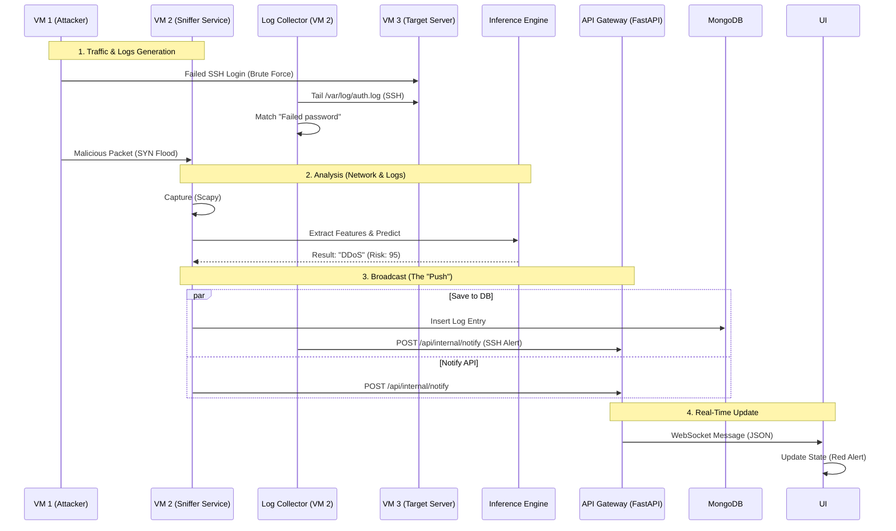

# System Architecture: Live Data Pipeline

This document explains exactly how "Live Logs" travel from the network wire to your screen.

## The "Push" Architecture
Unlike traditional systems that "fetch" (poll) database periodically, NetGuard uses a **Real-Time Push** architecture.



## detailed Step-by-Step

### 1. The Capture (`packet_sniffer.py`)
The Python script running on the backend uses **Scapy** to listen to the network interface (`eth0`).
- It grabs every packet.
- It filters out noise (e.g., localhost traffic).

### 2. The Brain (`inference.py`)
Before saving anything, the sniffer asks the **InferenceEngine** to classify the packet.
- **Input**: Source IP, Destination Port, Packet Size, Protocol.
- **Output**: Label (e.g., "Brute Force"), Risk Score (e.g., 75).

### 3. The Hand-off (`requests.post`)
This is crucial. The sniffer is a separate process from the API. To communicate, it makes an HTTP POST request to the API's internal webhook:
```python
# packet_sniffer.py
requests.post("http://localhost:8000/api/internal/notify", json=telemetry)
```

### 4. The Broadcast (`api_gateway.py`)
The API receives this data and immediately flushes it out to all connected WebSocket clients (the Frontend User).
```python
# api_gateway.py
@app.post("/api/internal/notify")
async def internal_notify(payload):
    await manager.broadcast(payload)
```

### 5. Validating History (`GET /api/threats`)
If you refresh the page, the "Live" data in memory is lost. The Frontend then **Fetches** historical logs from MongoDB to refill the table:
- **Frontend**: `GET /api/threats`
- **Backend**: Queries MongoDB for the last 100 entries.
